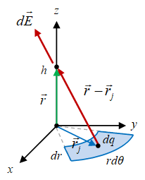

Elemen medan listrik $d\vec{E}$ yang disebabkan oleh elemen muatan $dq$ dari suatu cakram dengan rapat muatan permukaan homogen $\sigma$ diberikan dalam Fig. <a href="#fig:center-circular-plate">1</a>.





{:refdef: style="text-align: center;"}

 
Figure <a name="fig:center-circular-plate">1</a> Elemen muatan $dq$ menyebabkan elemen medan listrik $d\vec{E}$.
{: refdef}

Medan listrik $\vec{E}$ oleh satu titik muatan $q$ dapat diperluas menjadi elemen medan listrik $d\vec{E}$ oleh elemen muatan $dq$ dalam bentuk

\begin{equation}
\label{eqn:center-circular-plate}
d\vec{E} = \frac{1}{4\pi\epsilon_0} \frac{dq}{|\vec{r} - \vec{r}_j|^2} \frac{(\vec{r} - \vec{r}_j)}{|\vec{r} - \vec{r}_j|}.
\end{equation}

Untuk kasus ini $dq = \sigma dA$ dengan $dA = (dr)(rd\theta)$, yang merupakan salah satu elemen luas dalam sistem koordinat silinder. Vektor-vektor yang terlibat adalah $\vec{r} = h \hat{z}$, $\vec{r}_j = r \hat{r}$, dan $\vec{r} - \vec{r}_j = h \hat{z} - r \hat{r}$, serta $\|\vec{r} - \vec{r}_j\| = \sqrt{h^2 + r^2}$.

Medan listrik akibat suatu cakram berlubang dengan jari-jari dalam $r$ dan jari-jari luar $R$ adalah

<ol type="A">
<li>$\displaystyle \vec{E} = \frac{\sigma}{2\epsilon_0} \ \hat{z}$.</li>
<li>$\displaystyle \vec{E} = \frac{\sigma}{2\epsilon_0} \left( 1 - \frac{h}{\sqrt{h^2 + r^2}} \right) \hat{z}$.</li>
<li>$\displaystyle \vec{E} = \frac{\sigma}{2\epsilon_0} \left( \frac{h}{\sqrt{h^2 + r^2}} - \frac{h}{\sqrt{h^2 + R^2}} \right) \hat{z}$.</li>
<li>$\displaystyle \vec{E} = \frac{\sigma}{2\epsilon_0} \left( 1 - \frac{h}{\sqrt{h^2 + R^2}} \right) \hat{z}$.</li>
<li>$\displaystyle \vec{E} = \frac{\sigma}{2\epsilon_0} \left( \frac{h}{\sqrt{h^2 + R^2}} - \frac{h}{\sqrt{h^2 + r^2}} \right) \hat{z}$.</li>
</ol>


Jawab: C


+ [Article history](https://github.com/butiran/butiran.github.io/commits/master/_posts/fi1202/a03/2021-03-08-p01.md)
