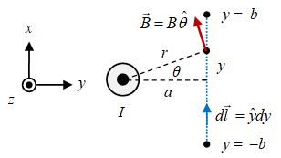

Terdapat sebuah kawat lurus panjang yang mengalirkan arus $I$ keluar dari bidang gambar menuju pembaca. Suatu lintasan garis lurus dari $y = -b$ sampai $y = b$ terletak pada jarak $a$ dari kawat tersebut, sebagaimana diberikan dalam gambar di bawah ini.

Ingin dihitung $\int \vec{B} \cdot d\vec{l}$ menggunakan lintasan garis lurus tersebut. Untuk memudahkan digunakan sistem koordinat berikut di mana pusat koordinat berda pada tengah kawat (tidak digambarkan demikian agar terlihat lebih sederhana).

Beberapa hal yang akan digunakan adalah

<ol>
<li>Untuk kawat lurus panjang $\displaystyle \vec{B} = \frac{\mu_0 I}{2 \pi r} \hat{\theta}$.</li>
<li>Vektor satuan posisi angular $\hat{\theta} = -\sin\theta \ \hat{x} + \cos\theta \ \hat{y}$.</li>
<li>Elemen panjang lintasan $d\vec{l} = \hat{y} dy$.</li>
<li>Integral dilakukan mulai dari $y = -b$ sampai $y = b$.</li>
<li>Perlu menggunakan solusi bentuk integral $\displaystyle \int \frac{ady}{a^2 + y^2}$.</li>
</ol>

Dengan demikian hasil integral

\begin{equation}\nonumber
\int_{y = -b}^{y = b} \vec{B} \cdot d\vec{l}
\end{equation}

adalah

<ol type="A">
<li>$\tan y + c$.
<li>$\tan^{-1} y + c$.
<li>$\tan (y/a) + c$.
<li>$\tan^{-1} (y/a) + c$.
<li>$\tan^{-1}(a/y) + c$.


\begin{eqnarray}
y = a \tan \theta \newline
dy = a \sec^2 \theta \ d\theta \newline
a^2 + y^2 = a^2 \sec^2 \theta \newline
\displaystyle \int \frac{a dy}{a^2 + y^2} = \int \frac{a (a\sec^2 \theta \ d\theta)}{a^2 \sec^2 \theta} = \int d\theta = \theta = \tan^{-1} \left(\frac{y}{a}\right) + c
\end{eqnarray}

